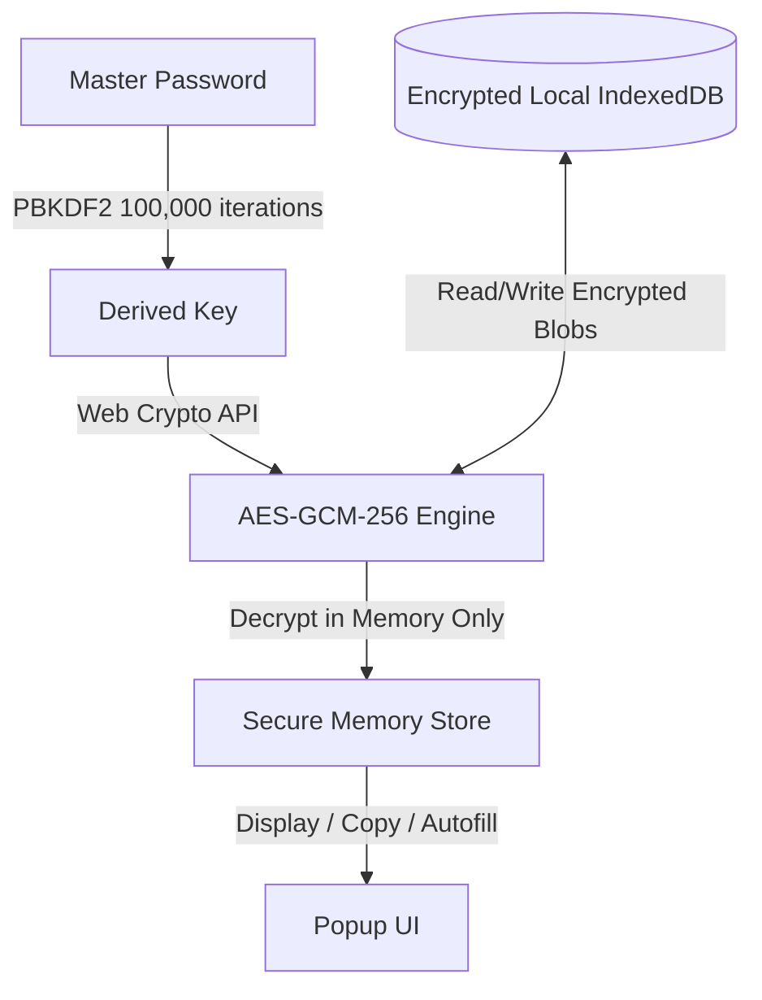

# <p align="center"><br>VaultGuard</p>

<p align="center">
  <strong>Local-First • Zero-Knowledge • AI-Powered Security Extension</strong>
</p>

<p align="center">
  <a href="https://typescriptlang.org"></a>
  <a href="https://react.dev"></a>
  <a href="https://developer.chrome.com/docs/extensions/mv3/intro/"></a>
  <a href="https://en.wikipedia.org/wiki/Galois/Counter_Mode"></a>
  <a href="#security-architecture"></a>
</p>

---

VaultGuard is a premium, startup-quality Chrome Extension designed to serve as an ultra-secure, local-first, zero-knowledge password manager. Featuring a futuristic glassmorphic UI, cinematic motion details, and integrated local intelligence, VaultGuard elevates the standard of personal credential management to a commercial SaaS product experience.

---

## 📸 Product Walkthrough

### 🔒 Zero-Knowledge Unlock
The extension prompts for a Master Password. All keys and derived credentials reside only in memory, transiently protected by strict memory clearing routines.

<p align="center">
  
</p>

### 📊 Modern Security Dashboard
A consolidated overview showing your security score, weak password indices, and interactive action triggers to run active scans or generate secure credentials instantly.

<p align="center">
  
</p>

### 🤖 Local AI Assistant
Analyze your password strength, generate complex strings, or discuss cryptographical hygiene directly inside the popup.

<p align="center">
  
</p>

### 🛡️ Deep Security Reports
Get an automated audit of your passwords: weak, reused, or expired credentials are highlighted with immediate recommendations.

<p align="center">
  
</p>

### ⚡ Context-Aware Autofill
Smooth, context-menu integrations let you quickly autofill saved credentials into target login fields securely.

<p align="center">
  
</p>

---

## ⚡ Core Features

### 🔐 Uncompromising Security
* **AES-GCM-256 Encryption:** Military-grade end-to-end symmetric encryption of the entire local vault.
* **PBKDF2 Key Derivation:** Master Passwords are derived locally using 100,000 iterations to guard against brute-force attacks.
* **Transient Memory Session:** Session keys are cleared immediately on lock or inactivity.
* **Automatic Clipboard Eraser:** Copied passwords are automatically cleared from the clipboard after 30 seconds.
* **Configurable Auto-Lock:** Vault locks automatically after a user-configured inactivity duration.

### 🧠 Intelligent Utilities
* **Interactive AI Security Assistant:** On-device guidance for improving security hygiene.
* **Algorithmic Strength Meter:** Instant cryptographic entropy calculations for generated passwords.
* **Proactive Security Scanning:** Runs local audits to identify duplicate, reused, or weak passwords.

### 🎨 Premium Visual Engineering
* **Futuristic Glassmorphic Layout:** Raycast-quality dark gradients, dynamic blur layers (`backdrop-filter: blur(28px)`), and neon accent highlights.
* **Cinematic Noise Texturing:** Custom SVG fractal noise overlay that removes flat digital gradients.
* **Tactile Spring Physics:** Button and card presses feature physical scale-down (`0.98`) interactions built on Framer Motion.
* **Staged Skeleton Loaders:** Non-blocking shimmers transition smoothly into rendered states.
* **Dynamic Sidebar Navigation:** Seamlessly route pages with layout animations.

---

## 🛡️ Security Architecture

VaultGuard operates under a strict **Zero-Knowledge Security Model**. This means your master credentials, derived keys, and unencrypted secrets never leave your device.



### Key Security Safeguards
1. **No Backend Services:** Data is stored locally in your browser's isolated IndexedDB instance. No servers, no syncing to untrusted clouds, no telemetry.
2. **Session Key Lifecycle:** The symmetric key is kept in an ephemeral state using Zustand. It is immediately zeroed out upon extension lock, browser close, or inactivity.
3. **Clipboard Isolation:** Written using native browser clipboard hooks to overwrite memory buffers shortly after password retrieval.

---

## 🛠️ Tech Stack

| Technology | Purpose | Key Library/API |
|---|---|---|
| **Core Framework** | Reactive component views & rendering | React 19, TypeScript 5 |
| **Bundling & Extension** | Manifest V3 build pipeline | Vite 8, `@crxjs/vite-plugin` |
| **Animation Engine** | Tactile physics & transitions | Framer Motion |
| **State Management** | Global transient state store | Zustand |
| **Database Engine** | Isolated, transactional storage | IndexedDB (via `idb` wrapper) |
| **Cryptographical Core** | Key derivation and data encryption | Web Crypto API (Browser Native) |
| **Style System** | Responsive, modern visuals | Vanilla CSS & TailwindCSS v4 |

---

## 📂 Architecture

```
vaultguard/
├── assets/
│   └── screenshots/     # Showcase media & product illustrations
├── public/
│   ├── icons/           # Extension icon assets (16x16, 32x32, 48x48, 128x128)
│   └── manifest.json    # Chrome Extension Manifest V3 configuration
├── src/
│   ├── animations/      # Spring physics and Framer Motion variants
│   ├── components/      # Shared components (Sidebar, AddItemModal, Toast, etc.)
│   ├── crypto/          # Cryptographical Web Crypto API wrappers
│   ├── hooks/           # Keyboard shortcut, clipboard, and lock timer listeners
│   ├── pages/           # Screen views (Dashboard, AI Assistant, Setup, Unlock, etc.)
│   ├── services/        # Background workers & content script handlers
│   ├── storage/         # IndexedDB wrapper and schema definitions
│   ├── types/           # Global TypeScript declarations
│   ├── utils/           # Helper scripts & favicon fetchers
│   ├── vault/           # Zustand state core
│   ├── App.tsx          # Root router & layout orchestrator
│   ├── index.css        # Premium typography & design system styles
│   └── main.tsx         # Virtual DOM mount point
├── package.json         # Dependencies & execution scripts
└── vite.config.ts       # Bundler configuration
```

---

## 🚀 Development Setup

Follow these instructions to run VaultGuard locally and inspect the code.

### Prerequisites
* **Node.js** (v18 or higher recommended)
* **npm** (v9 or higher)

### 1. Clone the repository
```bash
git clone https://github.com/Abhishek-047/Ai-Pass-Extension-.git
cd Ai-Pass-Extension-
```

### 2. Install dependencies
```bash
npm install
```

### 3. Run development mode
```bash
npm run dev
```

### 4. Build for Chrome
Generate the production bundle inside the `dist` directory:
```bash
npm run build
```

### 5. Install in Chrome
1. Open Google Chrome and navigate to `chrome://extensions/`.
2. Enable **Developer mode** using the toggle in the top-right corner.
3. Click the **Load unpacked** button in the top-left.
4. Select the build output directory (`dist`) from your project root.
5. VaultGuard will load and pin to your extension toolbar!

---

## 🗺️ Roadmap

- [ ] **Passkey Support:** WebAuthn integration for biometric and cryptographic key logins.
- [ ] **On-Device Local AI:** Integrate a lightweight transformer model directly into the extension context.
- [ ] **Encrypted P2P Syncing:** Optional, zero-knowledge decentralized synchronization across user devices.
- [ ] **Breach Intelligence:** Proactive scanning of credentials against local, offline lists of known compromised datasets.
- [ ] **Biometric Unlock:** System TouchID / FaceID authentication fallback.

---

## 💡 Philosophy

* **Local-First:** You own your data. VaultGuard will never transmit credentials over a network.
* **Privacy-First:** Zero user tracking. No analytics scripts, no performance reporting, complete structural anonymity.
* **Security-First Engineering:** Leverages native browser-provided sandbox environments and the audited Web Crypto API rather than custom crypto implementations.

---

## ⚠️ Disclaimer

VaultGuard is a portfolio and demonstration project. While it uses production-grade cryptographic principles (AES-GCM, PBKDF2), it is currently active under construction and has not undergone formal security audits. Use in production settings is at your own discretion.
