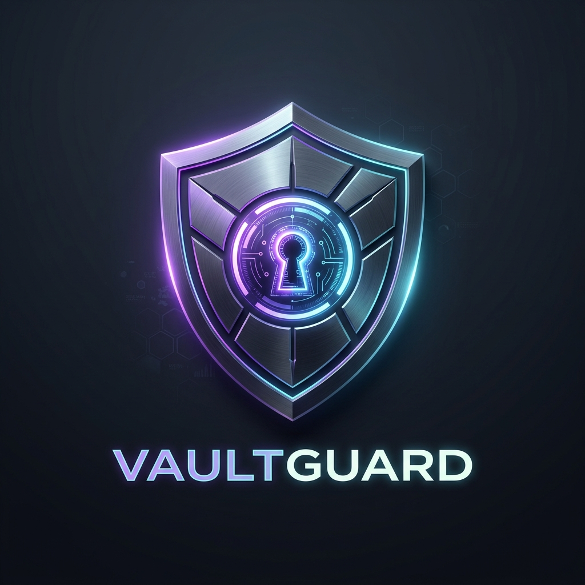
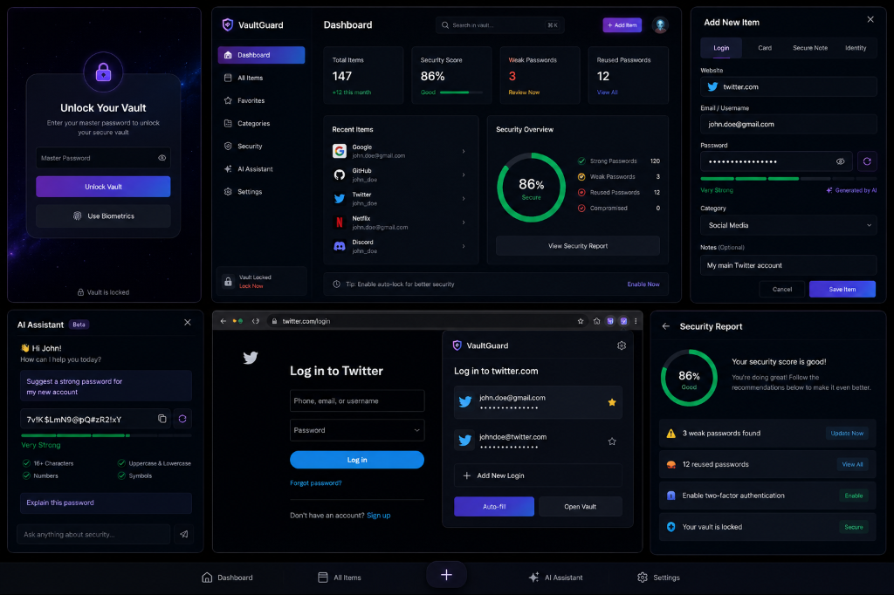
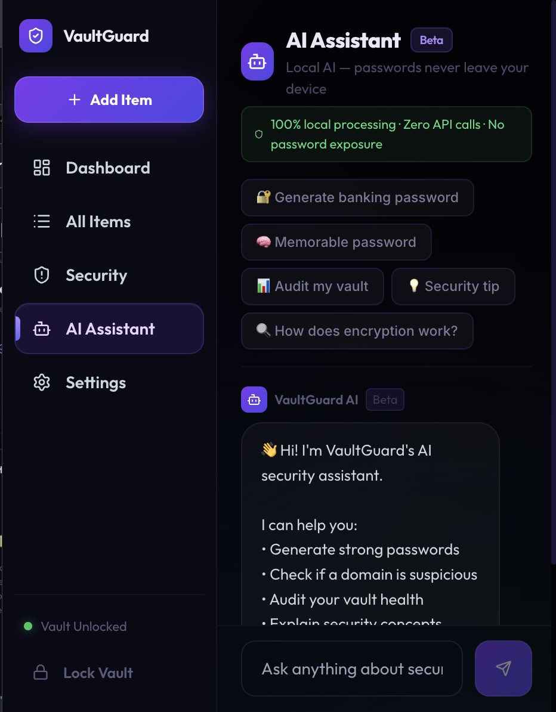
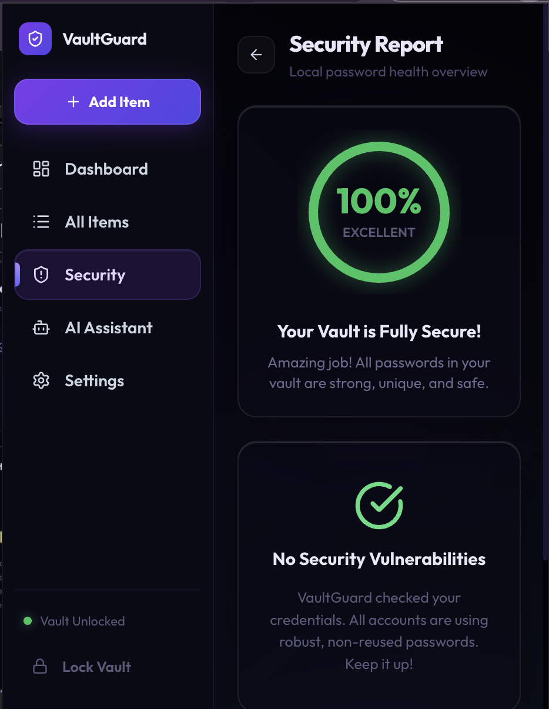
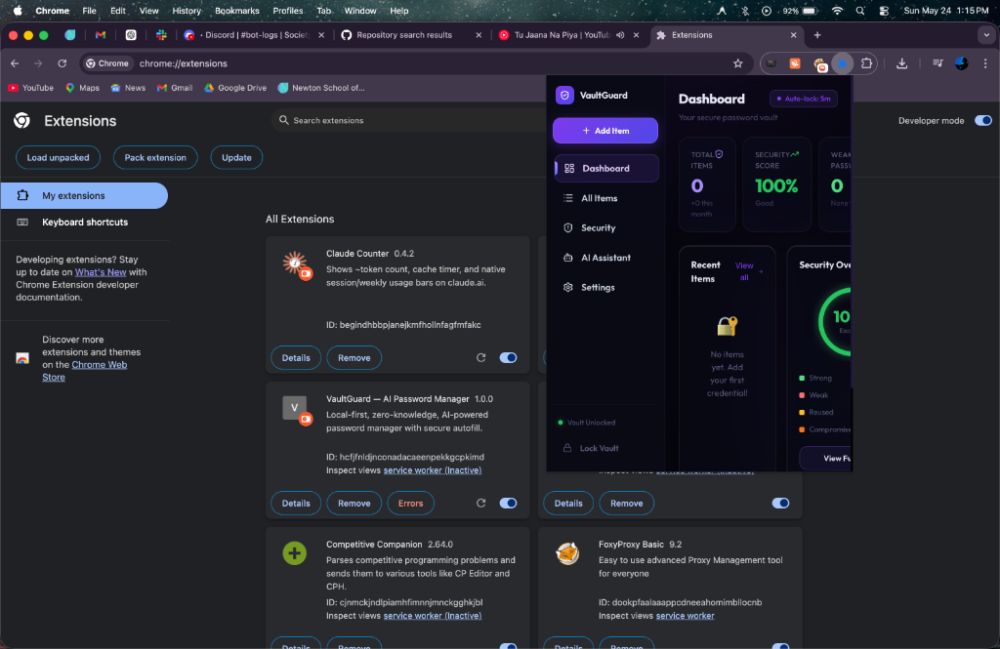
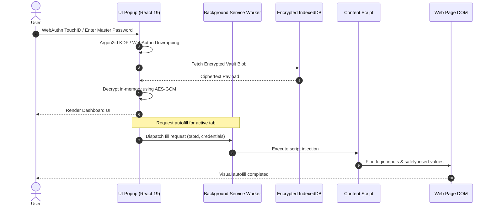

<p align="center">
  
</p>

<h1 align="center">VaultGuard</h1>

<p align="center">
  <strong>Local-First • Zero-Knowledge • Hardware-Secured Password Manager</strong>
</p>

<p align="center">
  A production-grade, high-performance Chrome Extension designed for secure credential orchestration. Built with modern web standards, strict zero-knowledge cryptography, native WebAuthn integrations, and a premium glassmorphic interface.
</p>

<p align="center">
  <a href="https://github.com/Abhishek-047/Ai-Pass-Extension-/stargazers"></a>
  <a href="https://github.com/Abhishek-047/Ai-Pass-Extension-/issues"></a>
  <a href="https://github.com/Abhishek-047/Ai-Pass-Extension-/blob/main/LICENSE"></a>
  <br/>
  <a href="https://typescriptlang.org"></a>
  <a href="https://react.dev"></a>
  <a href="https://developer.chrome.com/docs/extensions/mv3/intro/"></a>
  <a href="https://w3c.github.io/webcrypto/"></a>
</p>

---

## ✨ Why VaultGuard?

In an era dominated by centralized cloud services, standard password managers introduce a massive point of failure: their servers. High-profile cloud credential breaches have highlighted the dangers of storing vault files on remote databases.

VaultGuard reimagines password management through three fundamental principles:

1. **Local-First Storage:** Your vault lives entirely in your browser's sandboxed environment. No database servers, no sync servers, no central point of failure.
2. **Zero-Knowledge Architecture:** Cryptographical keys are derived on-the-fly and reside strictly within active transient memory. No unencrypted data is ever written to storage or transmitted over the wire.
3. **Aesthetic Excellence:** Security software shouldn't feel clinical. VaultGuard combines elite cybersecurity architecture with a premium user interface inspired by tools like Linear, Raycast, and Arc.

---

## 📸 Product Gallery

| 🔒 Hardware Biometric Unlock | 📊 Security Dashboard |
|:---:|:---:|
|  |  |
| Native TouchID/Windows Hello integration via WebAuthn. | Real-time integrity score, stats, and quick actions. |

| 🤖 On-Device Security Companion | 🛡️ Interactive Vulnerability Scan |
|:---:|:---:|
|  |  |
| Contextual local assistant for entropy audits. | Interactive audits of weak, duplicate, or expired entries. |

| ⚡ Secure Autofill Overlay |
|:---:|
|  |
| Domain-matched context-menu credentials fill fields instantly. |

---

## 🏗️ System Architecture

VaultGuard utilizes a secure multi-threaded model typical of modern WebExtensions, separating user interaction, background state orchestrators, and contextual DOM injections.



### Process Roles & Communication Flow
* **UI Popup (Foreground):** Handles the React application, key derivation (`Argon2id`), WebAuthn `navigator.credentials`, decryption (`AES-GCM`), and localized UI states.
* **Background Service Worker (Service Thread):** Orchestrates context-menus, extension lifecycles, and triggers native injection routines into active tabs.
* **Content Scripts (Isolated Worlds):** Injects helper modules to identify HTML inputs (`type="password"`, `type="email"`) without exposing the credentials to page-level JavaScript.

---

## 🔐 Cryptographical Architecture & Threat Model

### Cryptography Specifications
VaultGuard relies exclusively on the native browser **Web Crypto API** and **WebAuthn** to ensure performance and cryptographic correctness.

* **Key Derivation (KDF):**
  * Algorithm: `Argon2id` (WebAssembly-accelerated)
  * Memory Cost: `64 MB`
  * Salt: Cryptographically secure pseudo-random salt generated via Web Crypto `getRandomValues` on setup.
* **Hardware Biometrics:**
  * Uses WebAuthn **Discoverable Credentials (Passkeys)** to store a vault-wrapping key securely in the OS Secure Enclave / TPM.
  * Your Master Password is NEVER bypassed; the vault remains perfectly zero-knowledge.
* **Symmetric Encryption:**
  * Algorithm: `AES-256-GCM` (Galois/Counter Mode) for authenticated encryption.
  * IV (Initialization Vector): `12 bytes` unique vector for every write operation to prevent replay attacks.

---

### Threat Model & Countermeasures

| Attack Vector | Threat Scenario | VaultGuard Mitigation |
|---|---|---|
| **Phishing / Spoofing** | Malicious site mimics a legitimate domain to capture inputs. | Strict origin matching: VaultGuard queries the browser active tab URL using Chrome APIs and filters items to match the exact protocol and FQDN before display. |
| **iFrame / Input Sniffing** | Compromised scripts attempt to read inputs. | Autofill executes inputs programmatic updates directly on isolated DOM inputs rather than triggering keyboard events that can be intercepted by listeners. |
| **Memory Extraction** | Malware dumps memory to retrieve credentials. | The derived decryption key resides strictly in ephemeral Zustand memory and is wiped (`null` assigned) immediately when the session is locked or closed. |
| **Device Theft** | Physical attacker attempts to extract AES keys from disk. | Vault keys are encrypted and stored inside OS-level secure enclaves via WebAuthn, strictly requiring a live user biometric challenge (TouchID/FaceID) to decrypt. |

---

## 🎨 Premium Design System

VaultGuard adopts a carefully constructed visual design language designed to wow users:

* **Glassmorphic Compositing:** Built with HSL-tailored layers, `backdrop-filter: blur(28px) saturate(210%)`, and subtle purple gradient borders (`rgba(139, 92, 246, 0.22)`).
* **Cinematic Noise Overlays:** An SVG fractal noise filter is layered across the application background with `opacity: 0.025` and `mix-blend-mode: overlay` to break the flat look of modern screens.
* **Spring Mechanics:** Page transitions and modal popups use custom spring presets (e.g. `stiffness: 350, damping: 22, mass: 1.2`) to simulate natural inertia and tactile button press depths (`scale: 0.98` on click).

---

## 🛠️ Repository & Development Setup

### Prerequisites
* **Node.js** (v18.0.0 or higher)
* **npm** (v9.0.0 or higher)

### Installation
1. Clone the project locally:
   ```bash
   git clone https://github.com/Abhishek-047/Ai-Pass-Extension-.git
   cd Ai-Pass-Extension-
   ```
2. Install package dependencies:
   ```bash
   npm install
   ```
3. Run the development bundler with live reloading:
   ```bash
   npm run dev
   ```
4. Build the production package:
   ```bash
   npm run build
   ```
5. To load into Chrome:
   * Go to `chrome://extensions/`
   * Enable **Developer mode** (toggle, top-right).
   * Click **Load unpacked** (button, top-left).
   * Select the generated `dist` folder.

---

## 👥 Contribution & Guidelines

Contributions are welcome! Please review the standards below to ensure your pull requests align with the codebase design:

1. **Commit Message Conventions:** Follow [Conventional Commits](https://www.conventionalcommits.org/) (e.g., `feat: add passkey unlock`, `fix: clipboard clear timing`).
2. **Coding Standards:**
   - Type definitions must be explicit. Avoid using `any` types.
   - Separate business logic and storage interfaces from UI rendering files.
3. **Security Auditing:** Any code introducing new third-party dependencies, modifying cryptographic operations, or changing Content Security Policies (`CSP`) must undergo strict peer review.

---

## ⚖️ License & Open Source

This project is licensed under the **MIT License**. Check the [LICENSE](LICENSE) file for details.

Developed for educational and portfolio demonstration purposes. Under active engineering.
